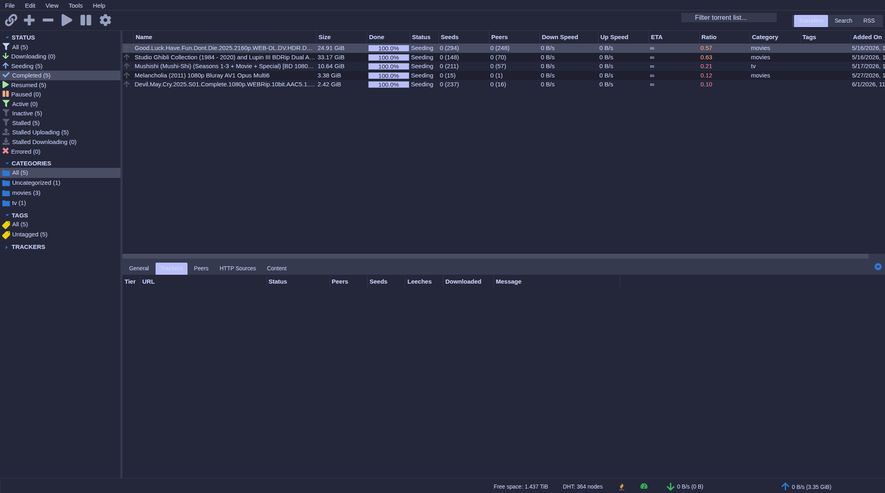

# Catppuccin Theme for qBittorrent WebUI
**_A beautiful light/dark theme for qBittorrent WebUI based on Catppuccin color palette_**

[preview]

# Features
- Automatic light/dark mode switching based on system preference
- Light mode: Catppuccin Latte
- Dark mode: Catppuccin Macchiato Lavender
- Custom icons and Fontawesome integration

# Installation

### Clone this repo (Windows)
1. Clone or download this repo as a .ZIP
2. Move it somewhere where qBittorrent can find it.

### Clone this repo (Linux)
1. `cd /opt`
2. `sudo git clone https://github.com/repslet/nightwalker.git`
3. `sudo chmod -R 777 nightwalker`

### Activate Alternative WebUI in qBittorrent
1. Under `Tools->Preferences->WebUI` enable `Use alternative WebUI`.
2. Choose a location that points to the `nightwalker` folder.
3. Restart qBittorrent or refresh your browser for changes to take effect.

You can also change these settings via the config file. The relevant entries are:

- WebUI\AlternativeUIEnabled=true
- WebUI\RootFolder=/path/to/nightwalker

### Update theme (Linux)
1. `cd /opt/nightwalker`
2. `git checkout main`
3. `git fetch origin main`
4. `git reset --hard origin/main`

# Credits
* Original Nightwalker theme by the Walkerservers community
* Catppuccin color palette by the Catppuccin team
* Modified by dephyre
* Fontawesome for their great fonts
* qBittorrent for the base files
* Cloned from https://github.com/repslet/nightwalker.git

[preview]: preview.png
[qbittorrentsource]: https://github.com/qbittorrent/qBittorrent/tree/master/src/webui/www1\
[theme.park]: https://github.com/gilbN/theme.park/wiki/qBittorrent
